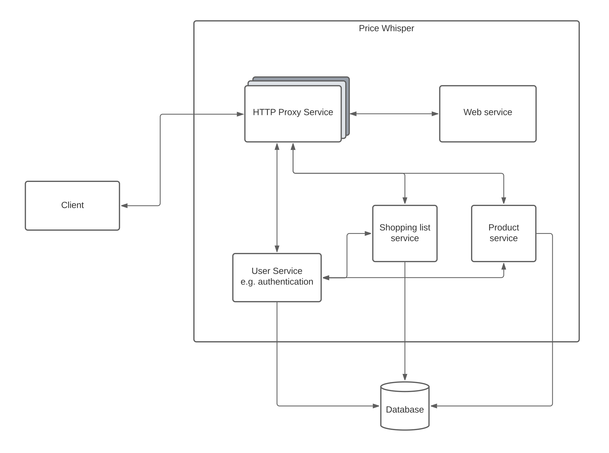

# Price Whisper


[](https://github.com/Onyxmoon/hsfl-master-ai-cloud-engineering/actions/workflows/run-tests-lib-folder.yml)
[](https://github.com/Onyxmoon/hsfl-master-ai-cloud-engineering/actions/workflows/run-tests-http-proxy-service.yml)
[](https://github.com/Onyxmoon/hsfl-master-ai-cloud-engineering/actions/workflows/run-tests-product-service.yml)
[](https://github.com/Onyxmoon/hsfl-master-ai-cloud-engineering/actions/workflows/run-tests-shoppinglist-service.yml)
[](https://github.com/Onyxmoon/hsfl-master-ai-cloud-engineering/actions/workflows/run-tests-user-service.yml)
[](https://github.com/Onyxmoon/hsfl-master-ai-cloud-engineering/actions/workflows/run-tests-web-service.yml)

PriceWhisper is your go-to destination for effortless savings on every shopping trip. Compare prices across supermarkets, find the best deals, and save money without the noise. Unlock the power of smart shopping with PriceWhisper.

PriceWhisper is an web application designed to streamline shopping experiences. Users can input their shopping list containing various products, and PriceWhisper meticulously scans multiple retailers, extracting pricing data given merchants.

The web app then analyze this data to provide you with a comprehensive cost breakdown of your shopping list, instantly identifying the most economical merchant for your trip. 

Key features:

- **Price Comparison:** PriceWhisper allows users to compare prices across multiple merchants.
- **Identifying Economical Merchants:** PriceWhisper instantly identifies and highlights the most economical merchant for each item on the user's shopping list and the complete shopping
- **Efficiency:** The platform streamlines the shopping experience, improving efficiency and reducing the effort required to find savings.
- **Data Aggregation:** The database aggregate pricing data from various merchants for one product.

## Prototypical architecture



## Setup project in Kubernetes
The complete application can be deployed within a kubernetes cluster. 
1. Manifest files for deployment (including monitoring) are located at [`kubernetes/manifests`](kubernetes/manifests)
2. It is optional but highly recommended to set your own username and password for the database access in manifest files (replace `db-username` and `db-pw-changeMe!` in each service manifest).
   > Some special characters are not possible because RQLite uses basic auth. Please use url-safe characters like Alphanumeric [0-9a-zA-Z], special characters $-_.+!*'(),.
3. The user service ([`price-whisper/user.yaml`](kubernetes/manifests/price-whisper/users.yaml)) uses JWT tokens for authentication while logged-in. A custom ECDSA private key can be specified as path or inline in environment variable `JWT_PRIVATE_KEY`.

   Generate a key with the following command:
   ```shell
   ssh-keygen -t ecdsa -f ./src/user-service/privateKey.pem -m pem
   ```
   > When step is missing, container will use a random but secure generated key on each start, but users will be logged-out at restarts.
4. Apply the manifests in `kubernetes/manifests` to your kubernetes control plane.
   ```shell
   kubectl apply -R -f ./kubernetes/manifests
   ```
5. The main page can be accessed via the public port of the `HTTP Proxy Service` container.
Monitoring can be accessed via the Grafana public port. There is an example dashboard configuration file at [kubernetes/grafana](kubernetes/grafana/dashboard-config.json).
## Setup project in Docker
### Requirements
- Docker Compose version v2.23.3
- a compatible container daemon

### Development setup via docker-compose
> The development setup exposes all ports to the host machine, so you can access each service individually. Docker will build locally and the database is not persistent in this setup.
1. Clone repository from Github `git clone https://github.com/Onyxmoon/hsfl-master-ai-cloud-engineering.git`
2. Set your own username and password for the database access in compose file (replace `db-username` and `db-pw-changeMe!`).
   > Some special characters are not possible because RQLite uses basic auth. Please use url-safe characters like Alphanumeric [0-9a-zA-Z], special characters $-_.+!*'(),.
3. Setup .env files for the following services or add the corresponding environment variables via compose file
   - [Product Service](src/product-service)
   - [Shopping list Service](src/shoppinglist-service)
   - [User Service](src/user-service)
4. Generate a secret private key for JWT token generation for the user service.

   Specify the path to an ecdsa private key or provide the content of one directly in environment variable `JWT_PRIVATE_KEY` at user service.

   You can generate a key with the following command:
   ```shell
   ssh-keygen -t ecdsa -f ./src/user-service/privateKey.pem -m pem
   ```
   > When step is missing, container will use a random but secure generated key on each start.
5. Run `docker compose -f docker-compose.dev.yml up -d` to start the containers defined in the Compose file
6. Run `docker compopse down` to stop container, networks, volumes, and images created by up.
### Normal setup via docker-compose
> The normal setup isolates the internal communication between services and only the proxy is reachable from the host machine. Prebuild images from Docker Hub will be used and database is persistent in this setup.
1. Use the docker-compose.yml from the root of this repository.
2. It is recommended to set your own username and password for the database access in compose file (replace `db-username` and `db-pw-changeMe!`).
   > Some special characters are not possible because RQLite uses basic auth. Please use url-safe characters like Alphanumeric [0-9a-zA-Z], special characters $-_.+!*'(),.
3. Generate a secret private key for JWT token generation for the user service. 
  
   Specify the path to an ecdsa private key or provide the content of one directly in environment variable `JWT_PRIVATE_KEY` at user service.
   
   You can generate a key with the following command:
   ```shell
   ssh-keygen -t ecdsa -f privateKey.pem -m pem
   ```
   > When step is missing, container will use a random but secure generated key on each start.
4. Run `docker compose -f docker-compose.yml up -d` to start the containers defined in the Compose file
5. Run `docker compose down` to stop container, networks, volumes, and images created by up.

## Testing
To run all tests, you can use the following command in the root directory:
```shell
go test -v hsfl.de/group6/hsfl-master-ai-cloud-engineering/...
```

### Integration tests
If you want to include integrations tests in your test flow use the following command:
```shell
go test -v hsfl.de/group6/hsfl-master-ai-cloud-engineering/... --tags=integration
```
> Please note, that a with [Testcontainers](https://testcontainers.com/) compatible container daemon is needed. 
> - Docker Desktop 
> - Docker Engine on Linux 
> - Testcontainers Cloud

## Authors

Dorien Grönwald<br>
dorien.groenwald@stud.hs-flensburg.de<br>
Hochschule Flensburg

Philipp Borucki<br>
philipp.borucki@stud.hs-flensburg.de<br>
Hochschule Flensburg

Jannick Lindner<br>
jannick.lindner@stud.hs-flensburg.de<br>
Hochschule Flensburg
